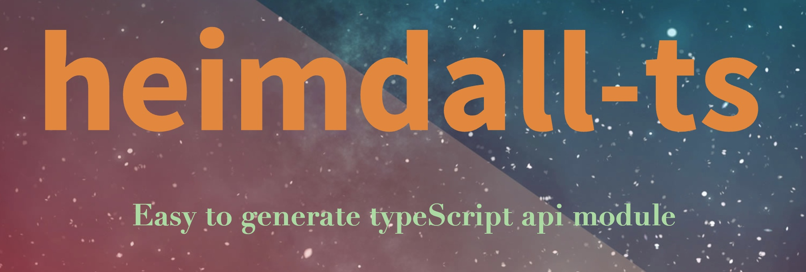

# heimdall-ts ✨

[中文](./README.md) ｜ [English](./README_EN.md)



Very simple to help you to generate typeScript api module  

(support swagger2.0 and OpenApi 3.0)

have fun ^_^

## Feature ❤️

- just need run script then you can get the latest typeScript api module

- you can diy request or response interceptor in you code

- strong type system can help you to code and easily smart tips

- compatible swagger2.0 and OpenApi3.0

- support import on demand that can help your project easy to tree shaking

- support rollback version 

- support multi openAPI repository

## Installation 🌝

Install heimdall-ts with npm

```bash
  npm install @imf/heimdall-ts -D
```

## Usage 🍉
just run script `heimdall -g` in script then can help you to generate typeScript api module code

All api files are in  **/node_modules/@imf/heimdall-ts/api** 

`api/index.ts`

```ts
//需要什么模块API直接按需导入就行了
import {
    MainUserApi,
    MainGameApi,
    MainEvoApi,
    MainYggApi,
    MainPpApi as MainPPApi,
    MainBgamingApi,
    MainSiteApi,
    MainFinanceApi,
    HeraclesWithdrawApi,
    HeraclesPayApi,
    HeraclesAdApi as AdApi,
} from '@imf/heimdall-ts';

import {AxiosRequestConfig, AxiosResponse} from 'axios';

//处理查询参数为数组的情况
import * as qs from 'qs';
//配置默认baseURL
const baseURL = '/api';

//baseAPI
const baseAPIMap = new Map();

baseAPIMap.set('heraclesWithdrawApi', HeraclesWithdrawApi);
baseAPIMap.set('heraclesPayApi', HeraclesPayApi);
baseAPIMap.set('adApi', AdApi);

//默认请求中间件
const requestMiddleWare = (config: AxiosRequestConfig) => {
    config = {
        ...config,
        headers: {
            user_token: localStorage.getItem('token') ?? '',
            // user_id: '8',
        },
        paramsSerializer: (params: any) => {
            return qs.stringify(params, {arrayFormat: 'comma'});
        },
    };
    return config;
};

//默认响应中间件
const responseMiddleWare = (res: AxiosResponse) => {
    //TODO
    return res;
};

const responseErrHandler = (error: any) => {
    return new Promise<Response>((resolve, reject) => {
        reject(error.response.data);
    });
};

const result: Record<string, any> = {};

for (let [key, value] of baseAPIMap) {
    result[key] = new value({
        baseURL: baseURL,
    });
    result[key].instance.interceptors.request.use(requestMiddleWare);
    result[key].instance.interceptors.response.use(responseMiddleWare, responseErrHandler);
}

type mainApi = {
    userApi: MainUserApi<unknown>
    gameApi: MainGameApi<unknown>,
    evoApi: MainEvoApi<unknown>,
}

const mainApi: mainApi = {
    userApi: result['userApi'],
    gameApi: result['gameApi'],
    evoApi: result['evoApi'],
};
export default mainApi;

```

## config 📖

config is required

`repo Parameters`

| Parameter   | Type     | Description                            | value            |
| :---------- | :------- | :------------------------------------- | :--------------- |
| `key` | `string` | **Required**  repoName                       | eg: kalista             |
| `value` | `string` | **Required**   the repo versionCode        | eg: 54ffc83 (^ means latest)         |

`package.json`

```json
  "heimdall": {
    "repo": {
        "kalista":"^",
        "demo":"^"
    }
  }
```

## Command 🪟

` get help`
```bash
heimdall -h
```

`generate api module code`

```bash
heimdall -g
```

`check stoplight version`
```bash
heimdall -l kalista
```


## Example 🐞

`package.json`

```json

"script":{
  "hemdall": "heimdall -g",
},
"heimdall": {
  "repo": {
    "kalista":"^",
    "demo":"^"
  }
}

```

## Q&A ❓

If you have any question,you can contact me in following ways

- Email : 976499226@qq.com


## Authors 👨‍💻

- [@sudongyuer](https://github.com/sudongyuer)


